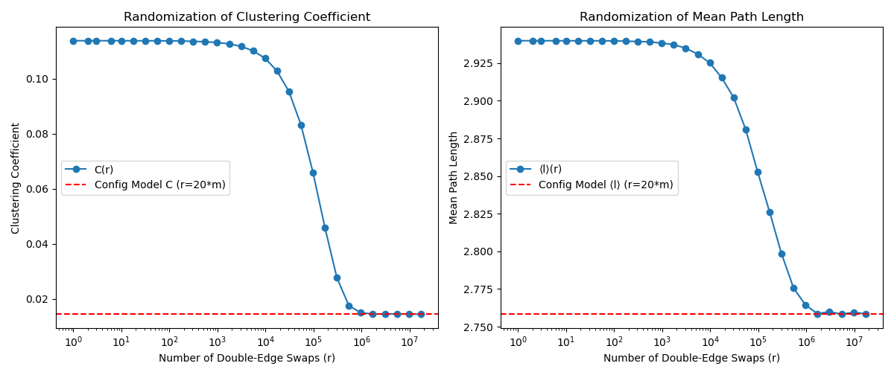
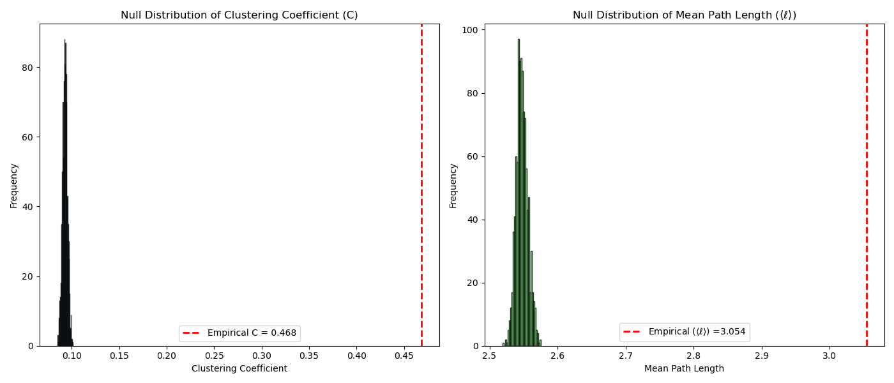
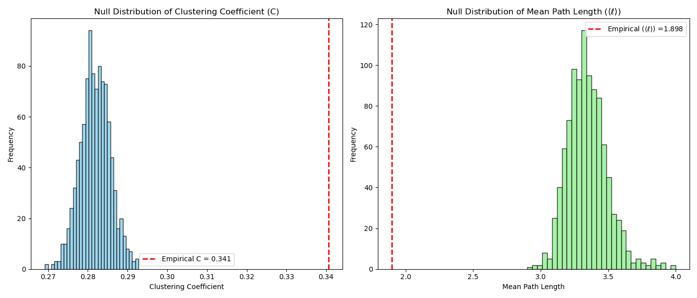
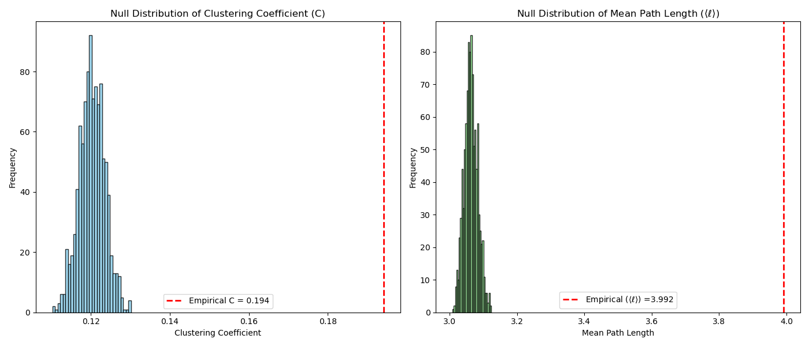
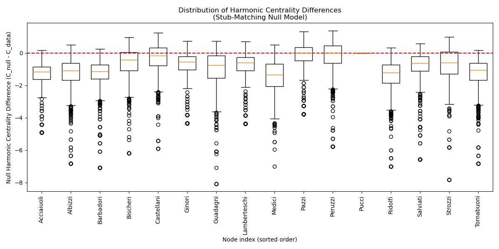

---
output:
  pdf_document: default
  html_document: default
---

# Problem Set 2 - Luis Paez

## Problem 1

Prove that: $\quad \frac{1}{C_A} + \frac{n_A}{n} = \frac{1}{C_B} + \frac{n_B}{n} \quad$ for an undirected, unweighted network of $n$ vertices that contains exactly two subnetworks of size $n_A$ and $n_B$, which are connected by a single edge $(A, B)$:

Given: <br>
$n=n_A + n_B$ <br>
$C_i = \frac{1}{l_i} = \frac{n}{\sum_{j} d_{ij}} \quad$ (7.29 Networks by Newman)

Let's define $\quad S_A = \sum_{j} d_{Aj}, \quad S_B = \sum_{j} d_{B} \quad \therefore \quad C_A = \frac{n}{S_A}, \quad C_B = \frac{n}{S_B} \quad \wedge \quad \frac{1}{C_A}= \frac{S_A}{n}, \quad \frac{1}{C_B}= \frac{S_B}{n}$

Let's define $\quad S_{A}^{A} = \sum_{y\in A} d_{Ay}, \quad S_{B}^{B} = \sum_{x\in B} d_{Bx}$

Notice that  $\quad S_A = \sum_{y\in A} d_{Ay} + \sum_{x\in B} (d_{Bx}+1) = S_{A}^{A} + S_{B}^{B} + n_B$ 

Likewise $\quad S_B = \sum_{x\in B} d_{Bx} + \sum_{y\in A} (d_{Ay} + 1) = S_{A}^{A} + S_{B}^{B} + n_A$ 

Thus $\quad S_A - n_B = S_B - n_A\quad \wedge \quad S_A + n_A = S_B + n_B$

Diving both sides by $n$ we get $\quad \frac{S_A}{n}+\frac{n_A}{n} = \frac{S_B}{n}+\frac{n_B}{n} \quad \wedge \quad \boxed{\frac{1}{C_A} + \frac{n_A}{n} = \frac{1}{C_B} + \frac{n_B}{n}}$

## Problem 2

### (a) Directed network preserving $k^{in}$ and $k^{out}$ 
- **(i)**: select two different random edges $(u,v)$ and $(x,y)$.
  - Ensure that there are no self loops : $u \neq v$, $x \neq y$
  - Ensure also that: $u \neq x$, $v \neq y$ and $u \neq y$, $x \neq v$ to avoid trivial rewiring and self-loops when swapping.
- **(ii)**: Replace $(u,v)$ and $(x,y)$ with $(u,y)$ and $(x,v)$
- **(iii)**: Verify that:
  - $u \neq v$, $x \neq y$ so no self-loops were introduced (redundant from part i)
  - $(u,y)$ and $(x,v)$ didn't exist in G to avoid multiedges.

### (b) Undirected bipartite network preserving the degree sequence and node type
- **(i)**: select two different random edges $(u,v)$ and $(x,y)$.
  - Ensure that network is bipartite $u,x \in V_{A}$ and $v,y \in V_{B}$
  - Ensure that there are no self loops: $u \neq v$ and $x \neq v$ 
- **(ii)**: Replace $(u,v)$ and $(x,y)$ with $(u,y)$ and $(x,v)$
- **(iii)**: Verify that:
  - $u,x \in V_{A}$ and $y,v \in V_{B} \quad$ (reduntant)
  - $(u,y)$ and $(x,v)$ not in G to avoid multiedges


## Problem 3

**How does the clustering coefficient and mean path lenght relax onto different configuration models with corresponding r value? How random was Berkely's social network to begin with, in what ways, and how randomization destroys its empirical patterns?** <br>
Both metrics start at high values compared to the configuration model, showing that Berkeley's social network has a high clustering coefficient and mean path lenght compared to an equivalent random network that preserves the degree distribution. As a function of r, as the network is randomized both the clustering coefficient and mean path lenght decrease in a similar fashion to a sigmoidal decay (when plotted in log scale). This behavior is expected for the clustering coefficient, since social networks show triadic closure (my friends are also friends) and increase the number of triangles present in the network compared to those that will occur if edges are swapped randomly (preserving degree sequence). 
The higher mean path lenght compared to the random model is also somehow expected for a big social network like Berkleys, suggesting that is structured into small connected groups (departments, groups of friends, peopel with shared interest) rather than every node showing a similar likelyhood to connect with any other node given their respective degree (such as in the configuration model). In conclusion, the Berkeley network wasn't random to begin with for its clustering coefficient and mean path lenght, as expected since it is a social network, and randomizing the network keeping the same degree structure destroys this empirical patterns observed. 

```
Original Full Graph: nodes = 22938 edges = 852444
Original Graph:
Clustering Coefficient: 0.1138
Mean Path Length (Largest Component): 2.9399
Swaps: 1, Clustering: 0.1138, Mean Path Length: 2.9399
Swaps: 2, Clustering: 0.1138, Mean Path Length: 2.9399
Swaps: 3, Clustering: 0.1138, Mean Path Length: 2.9399
Swaps: 6, Clustering: 0.1138, Mean Path Length: 2.9399
Swaps: 10, Clustering: 0.1138, Mean Path Length: 2.9399
Swaps: 18, Clustering: 0.1138, Mean Path Length: 2.9399
Swaps: 31, Clustering: 0.1138, Mean Path Length: 2.9399
Swaps: 56, Clustering: 0.1138, Mean Path Length: 2.9398
Swaps: 99, Clustering: 0.1138, Mean Path Length: 2.9398
Swaps: 176, Clustering: 0.1137, Mean Path Length: 2.9396
Swaps: 312, Clustering: 0.1136, Mean Path Length: 2.9394
Swaps: 553, Clustering: 0.1134, Mean Path Length: 2.9392
Swaps: 983, Clustering: 0.1132, Mean Path Length: 2.9383
Swaps: 1745, Clustering: 0.1127, Mean Path Length: 2.9374
Swaps: 3099, Clustering: 0.1118, Mean Path Length: 2.9349
Swaps: 5502, Clustering: 0.1102, Mean Path Length: 2.9310
Swaps: 9770, Clustering: 0.1074, Mean Path Length: 2.9252
Swaps: 17349, Clustering: 0.1028, Mean Path Length: 2.9153
Swaps: 30806, Clustering: 0.0953, Mean Path Length: 2.9022
Swaps: 54703, Clustering: 0.0833, Mean Path Length: 2.8811
Swaps: 97135, Clustering: 0.0660, Mean Path Length: 2.8529
Swaps: 172483, Clustering: 0.0459, Mean Path Length: 2.8261
Swaps: 306277, Clustering: 0.0277, Mean Path Length: 2.7983
Swaps: 543855, Clustering: 0.0175, Mean Path Length: 2.7757
Swaps: 965721, Clustering: 0.0150, Mean Path Length: 2.7643
Swaps: 1714828, Clustering: 0.0145, Mean Path Length: 2.7586
Swaps: 3045015, Clustering: 0.0145, Mean Path Length: 2.7600
Swaps: 5407023, Clustering: 0.0145, Mean Path Length: 2.7583
Swaps: 9601233, Clustering: 0.0145, Mean Path Length: 2.7595
Swaps: 17048880, Clustering: 0.0144, Mean Path Length: 2.7586
```


## Problem 4

**To what degree the clustering coefficient and mean path lenght are explained by the network's degree structure?Discuss whether the empirical values are big, small, typical, or unusual and what that conclusion implies about the structure of these networks. What hypotheses it suggests about the underlying data generating process that produced these networks.**
  
### (a) Online social network: Facebook frienships (2012)
Both the clustering coefficient and mean path lenght empirical values are significantly higher than the null distribution of the statistics (distribution of random graphs with equivalent degree sequence). This suggest that the formation of triangles and shortest average path distance of the graph are not fully explained by the degree structure alone.The empirical values are big compared to the null distribution for both C and mean path lenght. This suggest that the underlying phenomena modeled by the netowork tends to form triangle cliques and large path lenghts. This is expected since it is a social network, for the same reasons explained above for the Berkeley social network. Perhaps mean path lenght is more surprising since the network is not very large, but suggest that communities within are still formed. 
```
Network social_online_slavko.txt: nodes = 335, edges = 2218
```


### (b) Little Rock Lake food web (1991)
The empirical clustering coefficient is larger than the null distribution C, however, the mean path lenght is smaller than the corresponding statistic for the null distribution. The low empirical mean path lenght is somehow expected for a food web if the trophic levels are small. For instance, if there are only two trophic levels (predator and prey), then most nodes have only a distance of two edges since they are often connected by a common predator or prey. In this case, this suggest that this food web consist of few trophic levels. The high clustering coefficient is much more surprising here. Since most predators don't predate other predators, or other preys predate other preys, we would expect the empirical clustering coefficient to be smaller than the null distribution. However, this could suggest an inter-relationship between a high degree node (most likely a predator) with another high degree node (another predator for instance) that results in the formation of many triangles by their shared connections (preys)

```
Network bio_foodweb_out.maayan-foodweb.txt: nodes = 184, edges = 2476
```



### (c) C. elegans neurons (1986)
The clustering coefficient and mean path lenght empirical values are higher than in the null distribution. This is very intersting since suggest behavior of the neural connections and nervous system organization for c.elegans. For instance, the higher empirical value for C indicates that the neurons tend to form triangle connections ammong them, similar to the triadic closure behavior of social networks. Even though the biological mechanism governing this behavior is totally different, this analysis suggest that the neurons connected by neuron i are also likely to be connected. Additionally, the large empirical value for mean path lenght compared to the null distribution suggest the formation of cluster of neurons rather than a complete interconected system. This is indeed the case since the nervous system tends to be compartamentalized and in invertebrates such as c. elegans ganglion formation is known.  

```
Network bio_connectome_celegansneural.gml: nodes = 297, edges = 2345
```




## Problem 5

### (a)
The medici family appears to have the highest harmonic centrality among all families in the florentine network. Hence, this supports the hypothesis that its power and influenece came from positioning themselves in a central position on the network.

```
Node    Harmonic Centrality
Acciaiuoli      5.917
Albizzi         7.833
Barbadori       7.083
Bischeri        7.200
Castellani      6.917
Ginori          5.333
Guadagni        8.083
Lamberteschi    5.367
Medici          9.500
Pazzi           4.767
Peruzzi         6.783
Pucci           0.000
Ridolfi         8.000
Salviati        6.583
Strozzi         7.833
Tornabuoni      7.833
```
### (b)
The difference in the null and empirical harmonic centrality for the different families further supports the claim that the Medici family had its influence because of its central role in the network. This is because it has a value of zero, showing that the centrality score it has would be the same for a random graph that kept the degree structure of the florentine family network. Hence, it's centrality is well explained by the structure of the network and node position in it rather than other. Families with negative values have a higher centrality score than otherwhise would be explained just by a random graph with the same degree structure, and families with positive values have lower harmonic centrality scores than those observed in the null model.


### (c)
Changing the null model to have the wrong graph space, using the stub-matching algorithm, now shows a distorted difference in the harmonic centrality values for the null model and the empirical values. For instance, according to this model almost all families show higher empirical value than the observed in the random graphs. 



## Code

### Problem 3
```python
import igraph as ig
import matplotlib.pyplot as plt
import numpy as np

# ----------------------------
# 1. Load the Berkeley13.txt Network
# ----------------------------
G_full = ig.Graph.Read_Edgelist("Data/p3/Berkeley13.txt", directed=False)
G_full.simplify(multiple=True, loops=True)
m = G_full.ecount()
n = G_full.vcount()
print("Original Full Graph: nodes =", n, "edges =", m)

# ----------------------------
# 2. Compute the full network metrics
# ----------------------------
# Clustering coefficient
C_orig = G_full.transitivity_undirected()

# Extract largest component
components = G_full.connected_components()
largest_cc = components.giant()

# Mean path length
l_orig = largest_cc.average_path_length()

# Print metrics
print("Original Graph:")
print("Clustering Coefficient: {:.4f}".format(C_orig))
print("Mean Path Length (Largest Component): {:.4f}".format(l_orig))

# ----------------------------
# 3. Double-Edge Swaps
# ----------------------------
# Number of swaps r from 0 up to 20*m, using an increasing step size.
num_points = 30 
r_values = np.unique(np.round(np.logspace(0, np.log10(20 * m), num=num_points)).astype(int))

C_values = []
l_values = []

for r in r_values:
    G_random = G_full.copy()
    
    # Perform r double-edge swaps on the full graph
    G_random.rewire(n=r, mode="simple")
    G_random.simplify(multiple=True, loops=True)  # Ensure edges are not duplicated post-rewiring
    
    # Compute the clustering coefficient
    C = G_random.transitivity_undirected()
    
    # Extract the largest connected component
    components = G_random.connected_components()
    largest_cc = components.giant()
    
    # Compute the mean shortest path length
    try:
        l = largest_cc.average_path_length()
    except:
        l = np.nan
    
    C_values.append(C)
    l_values.append(l)
    
    print("Swaps: {:d}, Clustering: {:.4f}, Mean Path Length: {:.4f}".format(r, C, l))

# The configuration model baseline is when r = 20*m.
C_config = C_values[-1]
l_config = l_values[-1]

# ----------------------------
# 4. Plot the Results
# ----------------------------
plt.figure(figsize=(12, 5))

# Plot for Clustering Coefficient
plt.subplot(1, 2, 1)
plt.xscale('log')
plt.plot(r_values, C_values, 'o-', label="C(r)")
plt.axhline(y=C_config, color='r', linestyle='--', label="Config Model C (r=20*m)")
plt.xlabel("Number of Double-Edge Swaps (r)")
plt.ylabel("Clustering Coefficient")
plt.title("Randomization of Clustering Coefficient")
plt.legend()

# Plot for Mean Path Length
plt.subplot(1, 2, 2)
plt.xscale('log')
plt.plot(r_values, l_values, 'o-', label="⟨l⟩(r)")
plt.axhline(y=l_config, color='r', linestyle='--', label="Config Model ⟨l⟩ (r=20*m)")
plt.xlabel("Number of Double-Edge Swaps (r)")
plt.ylabel("Mean Path Length")
plt.title("Randomization of Mean Path Length")
plt.legend()

plt.tight_layout()
plt.savefig("Results/p3/p3.png")
plt.close()
```

### Problem 4
```python
import os
import igraph as ig
import matplotlib.pyplot as plt
import numpy as np

# Define input and output directories:
input_folder = "Data/p4/"
output_folder = "Results/p4/"
if not os.path.exists(output_folder):
    os.makedirs(output_folder)

# Helper function to plot an igraph graph on a given matplotlib axis:
def plot_igraph_on_ax(G, ax, title):
    # Compute a layout (using Fruchterman-Reingold)
    layout = G.layout("fr")
    coords = np.array(layout)
    
    # Draw all edges:
    for edge in G.get_edgelist():
        x0, y0 = coords[edge[0]]
        x1, y1 = coords[edge[1]]
        ax.plot([x0, x1], [y0, y1], color="gray", linewidth=0.5)
        
    # Draw vertices:
    ax.scatter(coords[:, 0], coords[:, 1], color="blue", s=10)
    ax.set_title(title)
    ax.set_axis_off()

# Loop through all files in the input folder:
for filename in os.listdir(input_folder):
    if filename.endswith(".gml") or filename.endswith(".txt"):
        file_path = os.path.join(input_folder, filename)
        
        # Read the graph based on its extension:
        if filename.endswith(".gml"):
            G_orig = ig.Graph.Read_GML(file_path)
        elif filename.endswith("foodweb.txt"):
            G_orig = ig.Graph.Read_Edgelist(file_path, directed=True)
        elif filename.endswith("slavko.txt"):
            G_orig = ig.Graph.Read_Edgelist(file_path, directed=False)
        
        # Ensure the graph is undirected and simple:
        if G_orig.is_directed():
            G_orig.as_undirected(mode="collapse")
        G_orig.simplify(multiple=True, loops=True)
        
        m = G_orig.ecount()
        n = G_orig.vcount()
        print(f"Network {filename}: nodes = {n}, edges = {m}")
        
        # Parameters for the experiment:
        num_samples = 1000           # number of configuration model graphs to generate
        num_swaps = 20 * m           # number of double-edge swaps to perform
        
        # Compute empirical measures:
        try:
            empirical_clustering = G_orig.transitivity_undirected()
        except Exception:
            empirical_clustering = np.nan
        try:
            empirical_path_length = G_orig.average_path_length()
        except Exception:
            empirical_path_length = np.nan
        
        # Lists to store null distribution values:
        clustering_vals = []
        path_length_vals = []
        
        # Generate null distribution by randomizing the graph (preserving degree sequence):
        for i in range(num_samples):
            G_rand = G_orig.copy()
            G_rand.rewire(n=num_swaps, mode="simple")
            try:
                clustering_vals.append(G_rand.transitivity_undirected())
            except Exception:
                clustering_vals.append(np.nan)
            try:
                path_length_vals.append(G_rand.average_path_length())
            except Exception:
                path_length_vals.append(np.nan)
        
        # Plot the null distributions:
        fig, axes = plt.subplots(1, 2, figsize=(14, 6))
        
        axes[0].hist(clustering_vals, bins=30, color='skyblue', edgecolor='black', alpha=0.8)
        axes[0].axvline(empirical_clustering, color='red', linestyle='dashed', linewidth=2,
                        label=f'Empirical C = {empirical_clustering:.3f}')
        axes[0].set_title("Null Distribution of Clustering Coefficient (C)")
        axes[0].set_xlabel("Clustering Coefficient")
        axes[0].set_ylabel("Frequency")
        axes[0].legend()
        
        axes[1].hist(path_length_vals, bins=30, color='lightgreen', edgecolor='black', alpha=0.8)
        axes[1].axvline(empirical_path_length, color='red', linestyle='dashed', linewidth=2,
                        label=f'Empirical 〈l〉 = {empirical_path_length:.3f}')
        axes[1].set_title("Null Distribution of Mean Path Length (〈l〉)")
        axes[1].set_xlabel("Mean Path Length")
        axes[1].set_ylabel("Frequency")
        axes[1].legend()
        
        plt.tight_layout()
        # Save the null distribution figure:
        null_fig_path = os.path.join(output_folder, f"{os.path.splitext(filename)[0]}_null.png")
        plt.savefig(null_fig_path)
        plt.close()
        
        # Generate a single configuration model instance:
        G_conf = G_orig.copy()
        G_conf.rewire(n=num_swaps, mode="simple")
        
        # Plot the original graph next to its configuration model:
        fig2, axes2 = plt.subplots(1, 2, figsize=(14, 7))
        plot_igraph_on_ax(G_orig, axes2[0], "Original Graph")
        plot_igraph_on_ax(G_conf, axes2[1], "Configuration Model Graph")
        
        plt.tight_layout()
        # Save the comparison figure:
        comp_fig_path = os.path.join(output_folder, f"{os.path.splitext(filename)[0]}_comparison.png")
        plt.savefig(comp_fig_path)
        plt.close()
```

### Problem 5
```python
import networkx as nx
import matplotlib.pyplot as plt

# Load the graph from a GML file
G = nx.read_gml('Data/p5/medici_network.gml')

# Compute the harmonic centrality for the original graph.
centrality_data = nx.harmonic_centrality(G)

# Get a sorted list of nodes for consistent ordering in printing and plotting.
nodes = sorted(G.nodes())
n = len(nodes)
m = G.number_of_edges()

# Print the harmonic centrality for each node.
print("Node\tHarmonic Centrality")
for node in nodes:
    print(f"{node}\t{centrality_data[node]:.3f}")

# -------------------------------
# Part B: Double-Edge Swap Null Model
# -------------------------------
def experiment_double_edge_swap(G, nodes, centrality_data, m, num_random=1000):
    # Store the null differences for each node (C_i^null - C_i^data).
    null_diff = {node: [] for node in nodes}
    r = 20 * m  # double-edge swaps to produce a random graph

    for i in range(num_random):
        G_rand = G.copy()
        try:
            nx.double_edge_swap(G_rand, nswap=r, max_tries=r * 10)
        except nx.NetworkXError as e:
            print(f"Double edge swap failed on iteration {i}: {e}")
        # Compute the harmonic centrality for the randomized graph.
        centrality_rand = nx.harmonic_centrality(G_rand)
        # Record the difference for each node.
        for node in nodes:
            diff = centrality_rand[node] - centrality_data[node]
            null_diff[node].append(diff)

    # Prepare the data for boxplot.
    data_to_plot = [null_diff[node] for node in nodes]
    
    # Create the boxplot.
    fig, ax = plt.subplots(figsize=(12, 6))
    ax.boxplot(data_to_plot, positions=range(len(nodes)), widths=0.6)
    ax.axhline(0, color='red', linestyle='--')
    ax.set_xlabel('Node index (sorted order)')
    ax.set_ylabel('Null Harmonic Centrality Difference (C_null - C_data)')
    ax.set_title('Distribution of Harmonic Centrality Differences\n(Double-Edge Swap Null Model)')
    plt.xticks(range(len(nodes)), nodes, rotation=90)
    
    plt.tight_layout()
    plt.savefig("Results/p5/p5_b.png")
    plt.close()

# -------------------------------
# Part C: Stub-Matching (Configuration Model) Null Model
# -------------------------------
def experiment_stub_matching(G, nodes, centrality_data, num_random=1000):
    # Store the null differences for each node (C_i^null - C_i^data).
    null_diff = {node: [] for node in nodes}
    # Obtain the degree sequence for stub-matching, using the sorted node order.
    degree_seq = [G.degree(n) for n in nodes]

    for i in range(num_random):
        # Generate a stub-labeled loopy multigraph using the configuration model.
        G_stub = nx.configuration_model(degree_seq, create_using=nx.MultiGraph)
        # Simplify the graph by converting to a simple graph:
        # - Collapses multiple edges and removes self-loops.
        G_simple = nx.Graph(G_stub)
        G_simple.remove_edges_from(nx.selfloop_edges(G_simple))
        # Relabel nodes so that node i corresponds to the i-th node in the sorted list.
        mapping = {i: nodes[i] for i in range(len(nodes))}
        G_simple = nx.relabel_nodes(G_simple, mapping)
        
        # Compute the harmonic centrality for the null model graph.
        centrality_rand = nx.harmonic_centrality(G_simple)
        # Record the difference for each node.
        for node in nodes:
            diff = centrality_rand[node] - centrality_data[node]
            null_diff[node].append(diff)

    # Prepare the data for boxplot.
    data_to_plot = [null_diff[node] for node in nodes]
    
    # Create the boxplot.
    fig, ax = plt.subplots(figsize=(12, 6))
    ax.boxplot(data_to_plot, positions=range(len(nodes)), widths=0.6)
    ax.axhline(0, color='red', linestyle='--')
    ax.set_xlabel('Node index (sorted order)')
    ax.set_ylabel('Null Harmonic Centrality Difference (C_null - C_data)')
    ax.set_title('Distribution of Harmonic Centrality Differences\n(Stub-Matching Null Model)')
    plt.xticks(range(len(nodes)), nodes, rotation=90)
    
    plt.tight_layout()
    plt.savefig("Results/p5/p5_c.png")
    plt.close()

# -------------------------------
# Run Both Experiments
# -------------------------------
experiment_double_edge_swap(G, nodes, centrality_data, m, num_random=1000)
experiment_stub_matching(G, nodes, centrality_data, num_random=1000)

# -------------------------------
# Plot the Graphs
# -------------------------------
# Generate a random graph using double-edge swaps (Experiment 1)
num_swaps = 20 * m
G_rand_swap = G.copy()
try:
    nx.double_edge_swap(G_rand_swap, nswap=num_swaps, max_tries=num_swaps * 10)
except nx.NetworkXError as e:
    print(f"Double edge swap failed during final plotting: {e}")

# Generate a random graph using stub-matching (Experiment 2)
degree_seq = [G.degree(n) for n in nodes]
G_stub = nx.configuration_model(degree_seq, create_using=nx.MultiGraph)
G_simple = nx.Graph(G_stub)
G_simple.remove_edges_from(nx.selfloop_edges(G_simple))
mapping = {i: nodes[i] for i in range(len(nodes))}
G_rand_stub = nx.relabel_nodes(G_simple, mapping)

# Plot all three graphs side by side.
fig, axs = plt.subplots(1, 3, figsize=(18, 6))

# Plot the original graph.
pos_original = nx.kamada_kawai_layout(G)
nx.draw(G, pos_original, ax=axs[0], with_labels=True, node_size=300, font_size=8)
axs[0].set_title("Original Graph")

# Plot the random graph from double-edge swap.
pos_swap = nx.kamada_kawai_layout(G_rand_swap)
nx.draw(G_rand_swap, pos_swap, ax=axs[1], with_labels=True, node_size=300, font_size=8)
axs[1].set_title("Random Graph (Double-Edge Swap Algorithm)")

# Plot the random graph from stub-matching.
pos_stub = nx.kamada_kawai_layout(G_rand_stub)
nx.draw(G_rand_stub, pos_stub, ax=axs[2], with_labels=True, node_size=300, font_size=8)
axs[2].set_title("Random Graph (Stub-Matching Algorithm)")

plt.tight_layout()
plt.savefig("Results/p5/graphs.png")
plt.close()
```